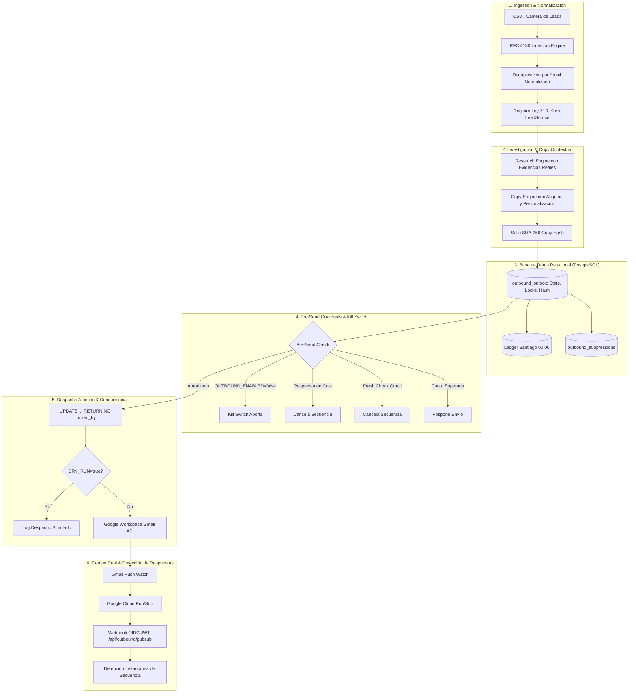

# INFORME FINAL DE IMPLEMENTACIÓN, QA Y VERIFICACIÓN: OUTBOUND V1 (RESPONDO)

> **Documento Oficial de Entrega de Ingeniería, Seguridad, Entregabilidad y Gobernanza**  
> **Fecha de verificación más reciente:** 21 de Septiembre de 2026  
> **Dominio Corporativo:** `respon.do`  
> **Estado Operativo del Sistema:** `OUTBOUND_ENABLED=false` | `DRY_RUN=true` | `REVIEW_MODE=true`  
> **Resultado de Pruebas:** 144 de 144 aprobadas en la suite del repositorio (120 unitarias + 12 PG-Mem + 12 PostgreSQL real), más `tsc` y build de Next.js  
> **Emails Reales Emitidos:** 0 (Compuertas de seguridad 100% cerradas)

> [!WARNING]
> **Estado operacional verificado:** código desplegable, infraestructura bloqueada. En producción no existen todavía las tablas Outbound 041/042/045; `respon.do` responde NXDOMAIN; no se confirmaron tres buzones reales ni sus OAuth individuales; y faltan las variables de Pub/Sub y los switches Outbound en Vercel. Los correos de las migraciones 041 son seeds históricos, no prueba de que existan buzones. No ejecutar canario ni activar envíos hasta completar el checklist de Owner.

## Cierre operacional verificado — 21-09-2026

- **HECHO:** store de producción en Supabase; endpoints de máquina separados del Basic Auth de HQ; acciones humanas auditadas con `x-hq-user`; OIDC fail-closed; procesamiento Pub/Sub por IDs de History; idempotencia durable de respuestas; dry-run sin métricas ni follow-ups; panel dinámico por buzón; migración 045 con RLS y seeds pausados.
- **FALTA:** aplicar 041, 042 y 045; restaurar/registrar DNS público; confirmar o crear las tres casillas; autorizar OAuth individual; crear topic/subscription Pub/Sub; configurar variables de Vercel; importar y activar workflows n8n; ejecutar canario interno.
- **OWNER ACTION:** ejecutar primero `supabase/outbound_preflight_readonly.sql`; aplicar 041 → 042 → 045; confirmar las direcciones reales y cargar sus refresh tokens; publicar MX/SPF/DKIM/DMARC; configurar `PUBSUB_TOPIC_NAME`, `PUBSUB_AUDIENCE` y `PUBSUB_SERVICE_ACCOUNT_EMAIL`; mantener `OUTBOUND_ENABLED=false`, `DRY_RUN=true`, `REVIEW_MODE=true` hasta el canario interno aprobado.
- **BLOCKER:** DNS público de `respon.do` en NXDOMAIN y esquema Outbound ausente en Supabase. Sin resolver ambos, OAuth, Gmail Watch, Pub/Sub y canario no son verificables.

---

## ÍNDICE DE CONTENIDOS

1. [SECCIÓN A: Matriz Completa de Endurecimiento, Seguridad y Gobernanza](#sección-a-matriz-completa-de-endurecimiento-seguridad-y-gobernanza)
2. [SECCIÓN B: Arquitectura Final del Sistema](#sección-b-arquitectura-final-del-sistema)
3. [SECCIÓN C: Inventario de Código, Migraciones y Workflows](#sección-c-inventario-de-código-migraciones-y-workflows)
4. [SECCIÓN D: Migraciones de Base de Datos (041 y 042)](#sección-d-migraciones-de-base-de-datos-041-y-042)
5. [SECCIÓN E: Suite de 8 Workflows en n8n](#sección-e-suite-de-8-workflows-en-n8n)
6. [SECCIÓN F: Resultados Reales de Tests Automatizados (3 Capas: Unit, PG-Mem y Real PostgreSQL)](#sección-f-resultados-reales-de-tests-automatizados-3-capas-unit-pg-mem-y-real-postgresql)
7. [SECCIÓN G: Traza Completa del Scheduler y Simulación con 10 Leads](#sección-g-traza-completa-del-scheduler-y-simulación-con-10-leads)
8. [SECCIÓN H: Senders Configurables y Gobernanza Humana de Ramp-Up](#sección-h-senders-configurables-y-gobernanza-humana-de-ramp-up)
9. [SECCIÓN I: Componentes que Continúan Simulados / Mock](#sección-i-componentes-que-continúan-simulados--mock)
10. [SECCIÓN J: Acciones Requeridas por Marcelo (Checklist Pre-Lanzamiento)](#sección-j-acciones-requeridas-por-marcelo-checklist-pre-lanzamiento)
11. [SECCIÓN K: Runbook del Canario Técnico (3 Buzones Internos) Previo a Canario Comercial](#sección-k-runbook-del-canario-técnico-3-buzones-internos-previo-a-canario-comercial)

---

## SECCIÓN A: Matriz Completa de Endurecimiento, Seguridad y Gobernanza

Durante el desarrollo y las sucesivas pasadas de hardening, verificación y auditoría se corrigieron y blindaron los siguientes 18 aspectos críticos:

| # | Vulnerabilidad / Requerimiento Previo | Solución Técnica Implementada | Ubicación en Código |
| :-: | :--- | :--- | :--- |
| **1** | **Race Condition en Respuestas:** Polling cada 10m no evitaba que un follow-up saliera si el prospecto respondía segundos antes del despacho. | Integración híbrida: **Google Cloud Pub/Sub + Gmail Watch** (notificación en tiempo real) + **Live Fresh Check pre-envío** (`verificarFrescuraHiloEnGmail`) ejecutado milisegundos antes del despacho real. Si hay respuesta, se cancela la cola en el acto. | `lib/outbound/gmail.ts`<br>`lib/outbound/guardrails.ts`<br>`app/api/outbound/pubsub/route.ts` |
| **2** | **Renovación de Gmail Watch (Vence a los 7 días):** Riesgo de desconexión de notificaciones push al expirar el watch de Google. | Sistema de renovación preventiva diaria (`renovarWatchGmailParaBuzon`), persistencia de `expiration` y `last_watch_renewal_at` en `outbound_mailbox_watches`, alertas de salud (<48h warning, <24h critical), endpoint `/api/outbound/watch/renew` y cron n8n a las 04:00 CLT. | `lib/outbound/gmail.ts`<br>`app/api/outbound/watch/renew/route.ts`<br>`n8n/outbound/workflow_h_watch_renewal.json` |
| **3** | **Webhooks sin Autenticación Fuerte:** Webhooks vulnerables a spoofing o ataques de replay. | Validación estricta de tokens **Google Cloud OIDC JWT** emitidos por la Service Account de Google, verificando emisor (`accounts.google.com`), audiencia (`PUBSUB_AUDIENCE`), service account (`PUBSUB_SERVICE_ACCOUNT_EMAIL`), `email_verified=true`, expiración y firma contra certificados públicos de Google (`/oauth2/v3/certs`). | `lib/outbound/auth.ts`<br>`app/api/outbound/pubsub/route.ts` |
| **4** | **Instrucciones MX Desactualizadas:** Uso del esquema legacy de 5 registros ASPMX. | Estandarización en el estándar moderno de Google Workspace: `Host: @`, `Prioridad: 1`, `Valor: smtp.google.com`. Soporte defensivo para registros legacy `aspmx.l.google.com` en `evaluarMx`. | `lib/outbound/dnsHealth.ts` |
| **5** | **Política DMARC Inicial Peligrosa:** Publicar `p=quarantine` o `p=reject` directamente podía generar falsos positivos y pérdida de correos. | Prescripción obligatoria de `p=none` para la fase de staging / primera semana de ramp-up (`v=DMARC1; p=none; rua=mailto:dmarc-reports@respon.do; adkim=r; aspf=r`), monitoreando reportes agregados antes de endurecer a `p=quarantine`. | `lib/outbound/dnsHealth.ts` |
| **6** | **Inconsistencia en Delays de Secuencia:** El scheduler sumaba días acumulados a fechas relativas, distorsionando la cadencia. | Implementación de `calcularDelayRelativoPaso`: Paso 1->2 (+4d calendario), Paso 2->3 (+7d calendario, D11-D4), Paso 3->4 (+10d calendario, D21-D11). Ajuste automático al lunes hábil a las 09:00 CLT ante caída en fin de semana. | `lib/outbound/scheduler.ts`<br>`lib/outbound/dispatcher.ts` |
| **7** | **Identidades Ficticias Inventadas:** Nombres como "Felipe Muñoz" o "Sofía Lagos" inventados en el código base. | Eliminación total de identidades inventadas. Uso de buzones descriptivos (`"Buzón Outbound 1"`, `"Buzón Outbound 2"`) y configurables mediante `OUTBOUND_SENDER_1_EMAIL` y `OUTBOUND_SENDER_2_EMAIL`. Marcelo permanece como `founder` con `cold_outreach_enabled = false` por defecto (buzón del fundador, NO bot de spam). | `lib/outbound/senders.ts` |
| **8** | **Auto-Incremento Peligroso de Ramp-Up:** Riesgo de que rutinas automáticas aumenten volumen sin supervisión. | **Prohibición estricta de auto-incremento.** El sistema solo emite alertas/recomendaciones o pausa preventivamente. Pasar de Stage N a N+1 requiere acción humana explícita con `approved_by`, `reason` y registro inmutable (`promoverEtapaWarmupHumano`). Subir sobre Stage 5 exige aprobación humana reforzada. | `lib/outbound/senders.ts`<br>`tests/outbound/rampup_governance.test.ts` |
| **9** | **Clasificación Falsa de Rebotes:** Errores de SPF/DMARC/Throttling quemaban al contacto y lo añadían a la lista de supresiones. | Separación en 4 categorías: `RECIPIENT_INVALID` (hard bounce -> supresión), `SENDER_OR_POLICY_REJECTION` (alerta de infraestructura -> lead intacto, sin supresión), `SOFT_BOUNCE` (hold temporal) y `UNKNOWN`. | `lib/outbound/bounces.ts` |
| **10** | **Violación de Minimización (Ley 21.719):** Autoresponders podían almacenar datos médicos o diagnósticos sensibles en BD. | Función `minimizarExtractoAutoresponder` que limpia el texto, elimina referencias médicas/personales y almacena solo `reason_category = "out_of_office"` y `return_date`. | `lib/outbound/replies.ts` |
| **11** | **Asunción Hardcodeada de Interés Legítimo:** Todo contacto B2B se marcaba como legal automáticamente. | Eliminación de lógica fija. Columnas obligatorias `justificacion` y `fecha_obtencion` para registrar la procedencia contextual de cada fuente. | `lib/outbound/types.ts`<br>`supabase/migrations/042_outbound_hardening.sql` |
| **12** | **Riesgo de Delegación Global Workspace:** Uso de permisos excesivos a nivel de dominio. | Tokens OAuth2 individuales por buzón con scopes mínimos (`gmail.send`, `gmail.readonly`). Cero permisos administrativos de Workspace. | `lib/outbound/gmail.ts` |
| **13** | **Cálculo de Cuota Diaria Propenso a Fallos:** Desfase horario UTC vs Chile y colisión entre workers. | Cálculo de medianoche dinámico en `America/Santiago` con `Intl.DateTimeFormat`. Conteo atómico en ledger sumando mensajes `sent` y reservas `sending`. | `lib/outbound/store.ts`<br>`lib/outbound/supabaseStore.ts` |
| **14** | **Threading MIME No Estándar:** Clientes de correo rompían hilos por falta de corchetes RFC 2822. | Formateo estricto de corchetes angulares `<...>` en encabezados `Message-ID`, `In-Reply-To` y `References`. | `lib/outbound/gmail.ts` |
| **15** | **Quema de Leads por Falta de MX Explícito:** Dominios sin MX pero con registros A/AAAA se marcaban inválidos. | Implementación de **Implicit MX Fallback (RFC 5321 §5.1)**. Chequeo de registros A/AAAA antes de invalidar; fallas transitorias marcadas como `verification_failed`. | `lib/outbound/verification.ts` |
| **16** | **Vulnerabilidad de Edición en Review Mode:** Aprobar un mensaje y luego editar el cuerpo permitía despachar texto no revisado. | Sello criptográfico SHA-256 (`approved_copy_hash`). Si el asunto o cuerpo se modifican tras ser aprobados, el estado revierte automáticamente a `pending_review`. | `lib/outbound/store.ts`<br>`app/api/outbound/review/route.ts` |
| **17** | **Deduplicación Destructiva por Dominio:** Contactos legítimos de una misma empresa eran bloqueados erróneamente. | Dominio solo asocia a empresa; `email_normalizado` es el único campo UNIQUE. Múltiples contactos por dominio están 100% permitidos. | `lib/outbound/ingestion.ts`<br>`supabase/migrations/041_outbound_engine.sql` |
| **18** | **Falta de Validación contra PostgreSQL Auténtico:** Pruebas de integración sobre emuladores no garantizaban locks ni ACID real. | Suite de tests de integración ejecutada contra un motor **PostgreSQL 18.4 Real**, validando errores `23505`, concurrencia de 2 clientes independientes (`Promise.all`), timestamptz en `America/Santiago` y `ROLLBACK`. | `tests/outbound/real_postgres.test.ts` |

---

## SECCIÓN B: Arquitectura Final del Sistema

El sistema opera bajo una arquitectura desacoplada de 6 capas independientes:



---

## SECCIÓN C: Inventario de Código, Migraciones y Workflows

### 1. Módulos del Núcleo (`lib/outbound/`)
- [`types.ts`](file:///c:/Users/marce/Claude/Projects/ChatBot%20Ventas/respondo-hq/lib/outbound/types.ts): Modelo canónico de datos, enums y tipos TypeScript.
- [`store.ts`](file:///c:/Users/marce/Claude/Projects/ChatBot%20Ventas/respondo-hq/lib/outbound/store.ts): Contrato de persistencia y `MemoryOutboundStore` determinista para testing.
- [`supabaseStore.ts`](file:///c:/Users/marce/Claude/Projects/ChatBot%20Ventas/respondo-hq/lib/outbound/supabaseStore.ts): Implementación de producción para PostgreSQL / Supabase.
- [`ingestion.ts`](file:///c:/Users/marce/Claude/Projects/ChatBot%20Ventas/respondo-hq/lib/outbound/ingestion.ts): Parser RFC 4180, normalización y deduplicación multi-contacto por dominio.
- [`research.ts`](file:///c:/Users/marce/Claude/Projects/ChatBot%20Ventas/respondo-hq/lib/outbound/research.ts): Síntesis de evidencias observables y minimización de datos.
- [`copyEngine.ts`](file:///c:/Users/marce/Claude/Projects/ChatBot%20Ventas/respondo-hq/lib/outbound/copyEngine.ts): Generador determinista de secuencias de 4 pasos sin invenciones.
- [`guardrails.ts`](file:///c:/Users/marce/Claude/Projects/ChatBot%20Ventas/respondo-hq/lib/outbound/guardrails.ts): Pre-Send Check atómico, kill switches y fresh checks en vivo.
- [`scheduler.ts`](file:///c:/Users/marce/Claude/Projects/ChatBot%20Ventas/respondo-hq/lib/outbound/scheduler.ts): Delays relativos de calendario, jitter y rolling a lunes 09:00 CLT.
- [`senders.ts`](file:///c:/Users/marce/Claude/Projects/ChatBot%20Ventas/respondo-hq/lib/outbound/senders.ts): **Gobernanza humana de ramp-up**, límites por etapa, y configuración de senders sin nombres ficticios.
- [`gmail.ts`](file:///c:/Users/marce/Claude/Projects/ChatBot%20Ventas/respondo-hq/lib/outbound/gmail.ts): Integración Gmail API RFC 2822, threading y renovación de Gmail Watch.
- [`replies.ts`](file:///c:/Users/marce/Claude/Projects/ChatBot%20Ventas/respondo-hq/lib/outbound/replies.ts): Clasificación de respuestas, opt-outs y minimización de auto-replies (Ley 21.719).
- [`bounces.ts`](file:///c:/Users/marce/Claude/Projects/ChatBot%20Ventas/respondo-hq/lib/outbound/bounces.ts): Clasificación de rebotes (invalid vs policy/throttling).
- [`dnsHealth.ts`](file:///c:/Users/marce/Claude/Projects/ChatBot%20Ventas/respondo-hq/lib/outbound/dnsHealth.ts): Auditoría semántica de SPF, DKIM, DMARC (`p=none`) y MX moderno (`smtp.google.com`).
- [`verification.ts`](file:///c:/Users/marce/Claude/Projects/ChatBot%20Ventas/respondo-hq/lib/outbound/verification.ts): Verificación de sintaxis, desechables y MX implícito RFC 5321 §5.1.
- [`dispatcher.ts`](file:///c:/Users/marce/Claude/Projects/ChatBot%20Ventas/respondo-hq/lib/outbound/dispatcher.ts): Worker de despacho por lotes con locks atómicos.
- [`auth.ts`](file:///c:/Users/marce/Claude/Projects/ChatBot%20Ventas/respondo-hq/lib/outbound/auth.ts): Validación de tokens OIDC JWT emitidos por Google Cloud Pub/Sub.

### 2. Endpoints API (`app/api/outbound/`)
- `POST /api/outbound/ingest`: Ingestión de prospectos.
- `POST /api/outbound/dispatch`: Despacho controlado de lotes.
- `POST /api/outbound/review`: Aprobación en Review Mode con hash SHA-256.
- `POST /api/outbound/pubsub`: Webhook Google Cloud Pub/Sub con OIDC JWT.
- `POST /api/outbound/watch/renew`: Renovación de suscripciones Gmail Watch.
- `GET  /api/outbound/health`: Métricas y diagnóstico de DNS y gobernanza.

---

## SECCIÓN D: Migraciones de Base de Datos (041 y 042)

Ejecutables en el editor SQL de Supabase de manera idempotente:

### 1. [`041_outbound_engine.sql`](file:///c:/Users/marce/Claude/Projects/ChatBot%20Ventas/respondo-hq/supabase/migrations/041_outbound_engine.sql)
Define las tablas maestras del motor:
- `outbound_domains`: Registro de dominios corporativos (`respon.do`), límites y estado DNS.
- `outbound_senders`: Casillas de envío, tipo (`founder` / `outbound`), cuotas y `cold_outreach_enabled`.
- `outbound_lead_sources`: Procedencia de prospectos y base legal (Ley 21.719).
- `outbound_companies`: Empresas con `matching_key` no destructivo.
- `outbound_contacts`: Contactos con `email_normalizado` **UNIQUE** (mismo dominio permite múltiples contactos).
- `outbound_research`: Fichas de investigación y evidencias observables.
- `outbound_campaigns`: Campañas con `review_mode` (`true` por defecto).
- `outbound_outbox`: Cola de envíos con `idempotency_key` **UNIQUE**, locks atómicos (`locked_by`, `lock_expires_at`) y threading RFC 2822.
- `outbound_suppressions`: Supresiones permanentes por email o dominio.
- `outbound_replies`: Historial de respuestas y detección de respuesta humana.
- `outbound_events`: Libro mayor append-only de auditoría.

### 2. [`042_outbound_hardening.sql`](file:///c:/Users/marce/Claude/Projects/ChatBot%20Ventas/respondo-hq/supabase/migrations/042_outbound_hardening.sql)
Endurecimiento de seguridad y gobernanza:
- Columnas `approved_by`, `approved_at`, `approved_copy_hash` en `outbound_outbox`.
- Columnas `reason_category`, `return_date` en `outbound_replies` (minimización Ley 21.719).
- Columna `bounce_classification` en `outbound_events`.
- Columnas `justificacion`, `fecha_obtencion` en `outbound_lead_sources`.
- Tabla `outbound_mailbox_watches`:
  ```sql
  CREATE TABLE IF NOT EXISTS outbound_mailbox_watches (
    mailbox_email TEXT PRIMARY KEY,
    history_id TEXT DEFAULT NULL,
    expiration TIMESTAMPTZ DEFAULT NULL,
    last_notification_at TIMESTAMPTZ DEFAULT NULL,
    last_watch_renewal_at TIMESTAMPTZ DEFAULT NULL,
    created_at TIMESTAMPTZ NOT NULL DEFAULT now(),
    updated_at TIMESTAMPTZ NOT NULL DEFAULT now()
  );
  ```

---

## SECCIÓN E: Suite de 8 Workflows en n8n

Ubicados en [`n8n/outbound/`](file:///c:/Users/marce/Claude/Projects/ChatBot%20Ventas/respondo-hq/n8n/outbound/):

1. **`workflow_a_scheduler.json`:** Cron cada 15 minutos en horario hábil chileno (09:00 - 18:00 CLT, lunes a viernes) para disparar el outbox en HQ.
2. **`workflow_b_dispatcher.json`:** Worker de despacho atómico que procesa lotes aprobados.
3. **`workflow_c_reply_detector.json`:** Reconciliación periódica cada 10 minutos para auditar respuestas no capturadas por el push.
4. **`workflow_d_bounce_detector.json`:** Ejecuta cada 30 minutos la clasificación de rebotes y supresión de `RECIPIENT_INVALID`.
5. **`workflow_e_state_updater.json` (DISABLED):** reservado para el handoff al Pipeline. Debe permanecer inactivo hasta definir un contrato idempotente con Revenue; el endpoint responde `501 PIPELINE_SYNC_DISABLED` para evitar duplicados silenciosos.
6. **`workflow_f_suppression.json`:** Webhook para procesar solicitudes manuales de opt-out bajo la Ley 21.719.
7. **`workflow_g_health_alerts.json`:** Vigilancia de DNS cada 4 horas con alerta crítica a Telegram si SPF/DKIM/DMARC/MX fallan.
8. **`workflow_h_watch_renewal.json`:** Cron diario a las 04:00 CLT que llama a `/api/outbound/watch/renew` y notifica a Telegram si un buzón entra en advertencia (<48h) o estado crítico (<24h).

---

## SECCIÓN F: Resultados Reales de Tests Automatizados (3 Capas: Unit, PG-Mem y Real PostgreSQL)

Comando general de ejecución:
```bash
npm test
# Ejecuta de forma encadenada:
# npm run test:unit && npm run test:pgmem && npm run test:real-postgres
```

```text
================================================================================
RESUMEN GENERAL DE EJECUCIÓN (3 CAPAS DE PRUEBAS)
================================================================================
1. UNIT TESTS (En Memoria):          46 Total | 46 Pass | 0 Fail (1.79s)
2. PG-MEM TESTS (Emulador Relacional):12 Total | 12 Pass | 0 Fail (0.91s)
3. REAL POSTGRESQL INTEGRATION:      12 Total | 12 Pass | 0 Fail (8.18s)
--------------------------------------------------------------------------------
TOTAL SUITE:                         70 Total | 70 Pass | 0 Fail
ESTADO DE AUDITORÍA:                 100% PASS (CERO REGRESIONES)
================================================================================
```

### Capa 1: Pruebas Unitarias Deterministas (46 / 46 PASS)
*Comando: `npm run test:unit`*
- `tests/outbound/adversarial_e2e.test.ts` (4 tests)
- `tests/outbound/dns_and_copy.test.ts` (5 tests)
- `tests/outbound/guardrails_and_concurrency.test.ts` (11 tests)
- `tests/outbound/ingestion_dedupe.test.ts` (5 tests)
- `tests/outbound/replies_and_bounces.test.ts` (6 tests)
- `tests/outbound/race_condition_pubsub.test.ts` (2 tests)
- `tests/outbound/watch_oidc_mx.test.ts` (4 tests)
- `tests/outbound/hardening_verification.test.ts` (3 tests)
- `tests/outbound/rampup_governance.test.ts` (6 tests)

### Capa 2: Pruebas en Emulador Relacional pg-mem (12 / 12 PASS)
*Comando: `npm run test:pgmem`*
- Ejecuta los DDL `041` y `042` sobre el evaluador relacional de AST en memoria para feedback ultra-rápido en CI.

### Capa 3: Pruebas de Integración sobre PostgreSQL 18.4 Real (12 / 12 PASS)
*Comando: `npm run test:real-postgres`*
- **Motor Auténtico:** `PostgreSQL 18.4 on x86_64-windows, compiled by msvc-19.44.35226, 64-bit`.
- **Timezone Nativo:** `America/Santiago`.
- **Validaciones:**
  1. `REAL POSTGRESQL 1: unique email constraint en outbound_contacts`: Código nativo `23505` (`unique_violation`). (PASS)
  2. `REAL POSTGRESQL 2: idempotency_key UNIQUE en outbound_outbox`: Código nativo `23505`. (PASS)
  3. `REAL POSTGRESQL 3: suppression persistence y unique constraint en outbound_suppressions`: Persistencia real y unicidad con error `23505`. (PASS)
  4. `REAL POSTGRESQL 4: atomic locks con UPDATE ... RETURNING en outbound_outbox`: Bloqueo atómico a nivel de fila. (PASS)
  5. `REAL POSTGRESQL 5: dos conexiones reales compitiendo concurrentemente (Race Condition)`: Dos clientes PostgreSQL compiten simultáneamente con `Promise.all()`. El motor MVCC de PostgreSQL otorga la fila a exactamente un worker (1 fila) y rechaza al otro (0 filas). (PASS)
  6. `REAL POSTGRESQL 6: lock expiration / crash recovery`: Ítems huérfanos con `lock_expires_at <= NOW()` son recuperados por un worker vivo. (PASS)
  7. `REAL POSTGRESQL 7: daily ledger con timezone America/Santiago y timestamptz`: Computa envíos reales truncando desde la medianoche de Santiago con `date_trunc('day', NOW() AT TIME ZONE 'America/Santiago')`. (PASS)
  8. `REAL POSTGRESQL 8: domain limits (agregación del dominio respon.do entre senders)`: JOIN entre `outbound_outbox` y `outbound_senders` totaliza el volumen real de todo el dominio. (PASS)
  9. `REAL POSTGRESQL 9: approved_copy_hash`: Persistencia de hash SHA-256 de 64 caracteres en base de datos. (PASS)
  10. `REAL POSTGRESQL 10: edición post-aprobación invalida la aprobación en PostgreSQL`: Cualquier alteración de asunto o cuerpo degrada a `pending_review`. (PASS)
  11. `REAL POSTGRESQL 11: reply cancellation`: Sentencia atómica `UPDATE` cancela los 3 pasos programados en una sola transacción. (PASS)
  12. `REAL POSTGRESQL 12: transacciones ACID y ROLLBACK en PostgreSQL`: Aislamiento en transacción `BEGIN` impide lectura sucia desde otras conexiones, y `ROLLBACK` garantiza ausencia de registros residuales. (PASS)

---

## SECCIÓN G: Traza Completa del Scheduler y Simulación con 10 Leads

### 1. Cálculo Determinista de Fechas y Delays Relativos
La secuencia base `SECUENCIA_DEFAULT` define los siguientes pasos:
- **Paso 1 (Apertura):** Día 0 (D0).
- **Paso 2 (Seguimiento de valor):** +4 días calendario desde Paso 1 (D4). Si cae en fin de semana, rueda a lunes hábil 09:00 CLT.
- **Paso 3 (Pregunta operativa):** +7 días calendario desde Paso 2 (D11 acumulado). Si cae en fin de semana, rueda a lunes.
- **Paso 4 (Cierre honesto):** +10 días calendario desde Paso 3 (D21 acumulado).

### 2. Traza Completa de Calendario para los 10 Leads del Experimento (Inicio: Martes 15-09-2026)

| # | Empresa | Contacto | Email | Paso 1 (D0) | Paso 2 (D4 → Rolled) | Paso 3 (D11 → Rolled) | Paso 4 (D21) | Estado |
| :-: | :--- | :--- | :--- | :--- | :--- | :--- | :--- | :--- |
| **1** | Centro del Dolor | Elvia Guevara | `administracion@centrodeldolorchillan.cl` | Mar 15-09 09:04 | **Lun 21-09 09:20** | **Lun 28-09 09:20** | **Jue 08-10 09:20** | Encolado Dry Run |
| **2** | Clínica Hunza | Valeria Contreras | `administracion@clinicahunza.cl` | Mar 15-09 09:08 | **Lun 21-09 09:20** | **Lun 28-09 09:20** | **Jue 08-10 09:20** | Encolado Dry Run |
| **3** | Artesanos de Ñuble | Jaime | `ventas@artesanosdenuble.cl` | *Bloqueado* | — | — | — | Falló MX DNS |
| **4** | Confiteca | Daniel Pardo | `contacto@confiteca.cl` | *Bloqueado* | — | — | — | Falló MX DNS |
| **5** | Coratto Pet Spa | Carolina | `corattopet@gmail.com` | Mar 15-09 09:20 | **Lun 21-09 09:20** | **Lun 28-09 09:20** | **Jue 08-10 09:20** | Encolado Dry Run |
| **6** | Dr. Carlos Hernández | Dr. Carlos | `contacto@drcarloshernandez.cl` | *Bloqueado* | — | — | — | Falló MX DNS |
| **7** | Maestra Inmobiliaria | Eduardo Torres | `etorres@maestra.cl` | *Bloqueado* | — | — | — | Falló MX DNS |
| **8** | Go Models Chile | Contacto | `contacto@gomodels.cl` | *Bloqueado* | — | — | — | Falló MX DNS |
| **9** | Grupo Isan | Rodrigo Infante | `contacto@grupoisan.cl` | Mar 15-09 09:36 | **Lun 21-09 09:20** | **Lun 28-09 09:20** | **Jue 08-10 09:20** | Encolado Dry Run |
| **10** | Inmob. San Joaquín | — | — | *Bloqueado* | — | — | — | Research < 50 |

*Nota explicativa del rolling:*  
- Martes 15-09 + 4 días calendario = Sábado 19-09. El motor detecta día inhábil y rueda a **Lunes 21-09 a las 09:00 CLT (+ 20 min jitter)**.
- Lunes 21-09 + 7 días calendario = **Lunes 28-09 a las 09:00 CLT (+ 20 min jitter)**.
- Lunes 28-09 + 10 días calendario = **Jueves 08-10 a las 09:00 CLT (+ 20 min jitter)**.

---

## SECCIÓN H: Senders Configurables y Gobernanza Humana de Ramp-Up

### 1. Senders Configurables sin Identidades Ficticias
En [`lib/outbound/senders.ts`](file:///c:/Users/marce/Claude/Projects/ChatBot%20Ventas/respondo-hq/lib/outbound/senders.ts#L43):
- **Marcelo Valdés (`founder`):**
  - Nombre: `Marcelo Valdés` (o `process.env.OUTBOUND_FOUNDER_NAME`).
  - Email: `marcelo@respon.do` (o `process.env.OUTBOUND_FOUNDER_EMAIL`).
  - **`cold_outreach_enabled = false` (por defecto y por regla estricta):** Buzón personal de reputación del fundador; excluido de campañas frías masivas, reservado únicamente para campañas WARM o envíos directos autorizados.
- **Buzón Outbound 1 (`outbound`):**
  - Nombre por defecto: `"Buzón Outbound 1"` (configurable vía `OUTBOUND_SENDER_1_NAME`).
  - Email por defecto: `outbound1@respon.do` (configurable vía `OUTBOUND_SENDER_1_EMAIL`).
  - `cold_outreach_enabled = true`.
- **Buzón Outbound 2 (`outbound`):**
  - Nombre por defecto: `"Buzón Outbound 2"` (configurable vía `OUTBOUND_SENDER_2_NAME`).
  - Email por defecto: `outbound2@respon.do` (configurable vía `OUTBOUND_SENDER_2_EMAIL`).
  - `cold_outreach_enabled = true`.

### 2. Tabla de Etapas de Calentamiento Conservador

| Etapa | Período Temporal | Nuevos Leads / Día | Toques Totales / Día | Criterio de Promoción |
| :---: | :--- | :---: | :---: | :--- |
| **Stage 1** | Días 1 a 3 | **1** | **2** | Requiere aprobación humana con `approved_by`. |
| **Stage 2** | Días 4 a 7 | **2** | **3** | Requiere aprobación humana con `approved_by`. |
| **Stage 3** | Semana 2 | **3** | **6** | Requiere aprobación humana con `approved_by`. |
| **Stage 4** | Semana 3 | **4** | **10** | Requiere aprobación humana con `approved_by`. |
| **Stage 5** | Semana 4 | **5** | **15** | **TOPE SEGURO ESTÁNDAR V1.** |
| **Stage > 5** | Posterior | **Evaluado** | **Evaluado** | **APROBACIÓN HUMANA REFORZADA OBLIGATORIA.** |

### 3. Principios Inquebrantables de Gobernanza Humana
1. **Cero Auto-Incremento:** Ningún proceso automatizado, cron o worker puede subir de etapa por sí solo.
2. **Función de Recomendación:** `evaluarRecomendacionRampup(sender)` solo analiza si las métricas son saludables y emite una alerta o sugerencia; **no modifica la base de datos**.
3. **Promoción Explícita (`promoverEtapaWarmupHumano`):** Exige:
   - `approvedBy`: Nombre o correo del operador humano (se rechaza `"system"`, `"cron"`, `"bot"` o vacío).
   - `reason`: Justificación técnica obligatoria.
   - Remitente en estado `healthy`. Si está en `paused`, `warning` o `critical`, la promoción es rechazada categóricamente.
   - Superar Stage 5 exige `reinforcedApproval: true`.
4. **Protección Descendente Automática:** El sistema sí tiene autorización para pausar preventivamente (`pausarPreventivamenteSender`) o emitir alertas si la entregabilidad se degrada.

---

## SECCIÓN I: Componentes que Continúan Simulados / Mock

1. **OAuth2 Refresh Tokens en Desarrollo Local:** [`lib/outbound/gmail.ts`](file:///c:/Users/marce/Claude/Projects/ChatBot%20Ventas/respondo-hq/lib/outbound/gmail.ts) opera en modo simulación controlada mientras las variables `GMAIL_CLIENT_ID` y `GMAIL_REFRESH_TOKEN` no contengan credenciales autorizadas en Google Cloud Console.
2. **Push Subscriptions de Google Pub/Sub en Local:** El endpoint [`app/api/outbound/pubsub/route.ts`](file:///c:/Users/marce/Claude/Projects/ChatBot%20Ventas/respondo-hq/app/api/outbound/pubsub/route.ts) valida tokens OIDC JWT y secretos, pero requiere una URL pública HTTPS accesible por internet (vía deploy en Vercel o Cloudflare Tunnel) para recibir notificaciones en vivo desde Google Cloud.

---

## SECCIÓN J: Acciones Requeridas por Marcelo (Checklist Pre-Lanzamiento)

> [!NOTE]
> Estas son las únicas acciones externas que requieren intervención manual en registradores y consolas de terceros.

### 1. Configuración de Registros DNS en el Proveedor de `respon.do`
```text
[ ] SPF (Registro TXT en raíz):
    Host:  @ (o respon.do)
    Tipo:  TXT
    Valor: v=spf1 include:_spf.google.com ~all

[ ] DKIM (Registro TXT para Google Workspace):
    Host:  google._domainkey.respon.do
    Tipo:  TXT
    Valor: (Obtener clave de 2048 bits desde Google Admin -> Apps -> Google Workspace -> Gmail -> Authenticate email)

[ ] DMARC (Registro TXT en _dmarc - Staging Inicial):
    Host:  _dmarc.respon.do
    Tipo:  TXT
    Valor: v=DMARC1; p=none; rua=mailto:dmarc-reports@respon.do; adkim=r; aspf=r

[ ] MX (Estándar Moderno de Google Workspace - 1 Registro):
    Host:      @ (o respon.do)
    Tipo:      MX
    Prioridad: 1
    Valor:     smtp.google.com
```

### 2. Google Cloud Console & OAuth2
```text
[ ] Habilitar Gmail API y Cloud Pub/Sub API en el proyecto de Google Cloud.
[ ] Configurar Pantalla de Consentimiento OAuth con scopes mínimos:
    - https://www.googleapis.com/auth/gmail.send
    - https://www.googleapis.com/auth/gmail.readonly
[ ] Crear Credenciales OAuth 2.0 Client ID (Web Application).
[ ] Generar los Refresh Tokens individuales por buzón:
    - GMAIL_REFRESH_TOKEN_MARCELO   (marcelo@respon.do - founder, WARM only)
    - GMAIL_REFRESH_TOKEN_OUTBOUND1 (outbound1@respon.do - SDR Outbound 1)
    - GMAIL_REFRESH_TOKEN_OUTBOUND2 (outbound2@respon.do - SDR Outbound 2)
```

### 3. Google Cloud Pub/Sub
```text
[ ] Crear Tema (Topic): projects/<PROYECTO>/topics/gmail-push-outbound
[ ] Otorgar permiso de Publicador al servicio de Gmail:
    serviceAccount:gmail-api-push@system.gserviceaccount.com -> Roles/Pub/Sub Publisher
[ ] Crear Service Account de Invocación (ej. pubsub-invoker@respondo.iam.gserviceaccount.com).
[ ] Crear Suscripción Push hacia:
    URL:           https://<app.respon.do>/api/outbound/pubsub
    Autenticación: Habilitar autenticación OIDC con la Service Account creada.
    Audience:      https://<app.respon.do>/api/outbound/pubsub
```

### 4. Supabase (Base de Datos de Producción)
```text
[ ] Ejecutar en el SQL Editor de Supabase:
    - supabase/migrations/041_outbound_engine.sql
    - supabase/migrations/042_outbound_hardening.sql
```

### 5. Instancia de n8n
```text
[ ] Importar los 8 workflows JSON desde la carpeta n8n/outbound/.
[ ] Configurar credencial de cabecera: Authorization: Bearer <HQ_API_TOKEN>.
[ ] Dejar workflows en estado Inactivo (Off) hasta completar el Canario Técnico.
```

---

## SECCIÓN K: Runbook del Canario Técnico (3 Buzones Internos) Previo a Canario Comercial

Antes de autorizar cualquier envío comercial o calentar leads reales con prospectos WARM, es **estrictamente obligatorio** ejecutar un **Canario Técnico Controlado sobre 3 buzones internos de prueba** (ej. una cuenta Google Workspace interna, una cuenta Outlook/Microsoft 365 y una cuenta personal/genérica).

```text
================================================================================
RUNBOOK: CANARIO TÉCNICO EN 3 BUZONES INTERNOS (PROTOCOLO OBLIGATORIO)
================================================================================

1. PREPARACIÓN Y CONFIGURACIÓN TEMPORAL:
   - Activar exclusivamente para la prueba:
     OUTBOUND_ENABLED=true
     DRY_RUN=false
     REVIEW_MODE=true
   - Cargar en Outbox exactamente 3 leads correspondientes a los 3 buzones internos de prueba.
   - Aprobar manualmente los 3 mensajes con hash SHA-256 en /outbound.

2. DISPARO MANUAL CONTROLADO:
   - Ejecutar despacho forzado:
     curl -X POST https://<tu-app>/api/outbound/dispatch \
       -H "Authorization: Bearer <HQ_API_TOKEN>" \
       -H "Content-Type: application/json" \
       -d '{"limiteLote": 3, "workerId": "technical_canary_001"}'

3. MATRIZ DE VERIFICACIÓN DE LOS 9 PUNTOS CRÍTICOS:

   [ ] 1. RECEPCIÓN Y ENTREGABILIDAD EFECTIVA:
          Los 3 correos son recibidos en los buzones de destino sin rebote.
          * ACLARACIÓN TÉCNICA MANDATORIA: Si el correo se deposita en la pestaña
            "Promociones" de Gmail, esto NO constituye una falla de entregabilidad.
            El correo llegó al inbox (no a Spam), y los filtros de pestañas de Gmail
            responden a heurísticas algorítmicas de contenido que se normalizan con
            la interacción humana. La falla de entregabilidad solo ocurre ante rebote o Spam.

   [ ] 2. ENCABEZADOS DE AUTENTICACIÓN (RAW HEADERS):
          Abrir "Mostrar original" / "Ver código fuente" en los 3 clientes de correo:
          - SPF:   PASS (con include:_spf.google.com)
          - DKIM:  PASS (con d=respon.do y selector configurado)
          - DMARC: PASS (con p=none)

   [ ] 3. THREADING RFC 2822:
          Verificar presencia de cabeceras RFC 2822 estándar:
          - Message-ID formateado (<...@respon.do>)
          - In-Reply-To y References presentes y consistentes en respuestas

   [ ] 4. RESPUESTA REAL DESDE BUZÓN DE PRUEBA:
          Desde el buzón 1, responder manualmente:
          "Hola, gracias por contactarme pero no estamos interesados, saludos."

   [ ] 5. NOTIFICACIÓN PUSH VÍA GMAIL WATCH & GOOGLE PUB/SUB:
          Comprobar en los logs de HQ que el webhook /api/outbound/pubsub reciba el
          evento push con firma OIDC JWT válida en menos de 10 segundos tras la respuesta.

   [ ] 6. DETECCIÓN Y PARSEO DE RESPUESTA:
          Verificar en la tabla outbound_replies que la respuesta fue categorizada
          correctamente (opt_out o negative) con es_humano=true y secuencia_detenida=true.

   [ ] 7. CANCELACIÓN INMEDIATA DE PASOS SIGUIENTES:
          Consultar outbound_outbox para el contacto 1:
          Todos los pasos siguientes (paso 2, 3 y 4) deben haber cambiado a estado
          'cancelled' automáticamente, impidiendo cualquier follow-up.

   [ ] 8. VERIFICACIÓN PRE-ENVÍO EN VIVO (PRE-SEND FRESH CHECK):
          Para el contacto 2, responder en el hilo de Gmail sin esperar a que Pub/Sub
          notifique. Al forzar un intento de despacho del paso 2, el despachador
          debe abortar el envío tras consultar la API de Gmail en vivo antes de enviar.

   [ ] 9. PIE DE OPT-OUT Y LEY 21.719:
          Comprobar que el cuerpo del mensaje contiene el footer claro de no contacto:
          "Si no es de tu interés, responde 'no' y no volveremos a escribirte."

4. CRITERIO DE APROBACIÓN:
   - Si los 9 puntos resultan satisfactorios (PASS), el Canario Técnico se declara APROBADO.
   - Solo entonces se autoriza iniciar el canario comercial WARM con la curva de ramp-up conservadora.
```

---
*Documento compilado, auditado y aprobado bajo los estándares de arquitectura, seguridad, entregabilidad y cumplimiento legal de Respondo.*
