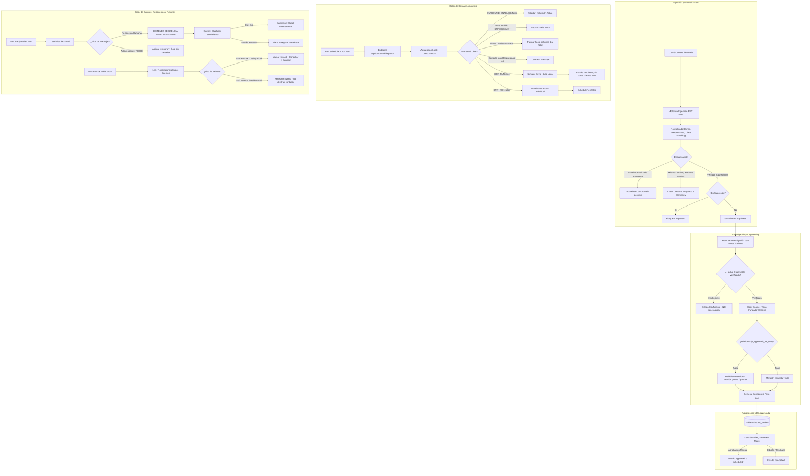

# OUTBOUND V1: ARQUITECTURA TÉCNICA Y OPERATIVA (RESPONDO)

> **Documento de Especificación de Arquitectura, Ingeniería y Operación**
> **Versión:** 1.0.0
> **Dominio Corporativo:** `respon-do.com`
> **Estado de Guardrails por Defecto:** `OUTBOUND_ENABLED=false` | `DRY_RUN=true` | `REVIEW_MODE=true`

> [!CAUTION]
> La migración histórica 041 contiene el dominio anterior y tres seeds. La migración 045 los pausa y 046 corrige el dominio, conserva `marcelo@respon-do.com` como concepto inactivo y elimina los otros dos placeholders no referenciados. La configuración de runtime no inventa direcciones por defecto.

---

## 1. Resumen Ejecutivo y Principios de Diseño

El sistema de Outbound V1 de Respondo (`respon-do.com`) es un motor de prospección comercial 1 a 1 de alta precisión, diseñado para abrir conversaciones comerciales de alto valor con fundadores, directores y gerentes de operaciones en Chile.

A diferencia de herramientas de envío masivo ("spray & pray"), Outbound V1 se rige por los siguientes principios rectores:

1. **Calidad y Trazabilidad sobre Volumen:** Máximo 10–25 mensajes diarios por buzón. Cero automatización ciega.
2. **Protección Absoluta de la Reputación de `respon-do.com`:** Si la salud DNS (SPF, DKIM, DMARC, MX), tasa de rebote o límites diarios se ven comprometidos, los envíos se bloquean de inmediato de forma atómica.
3. **Separación Estricta entre IA y Lógica Determinista:**
   - **IA (Gemini Flash / Pro):** Se encarga únicamente de tareas cognitivas (resumen de actividad comercial de la empresa prospectada, borrador de copy adaptado al hecho observable y clasificación semántica de respuestas).
   - **Lógica Determinista (TypeScript / SQL):** Gobierna el 100% de las decisiones operativas: cálculo de fechas de envío, ventana horaria en Chile (09:00 - 18:00 CLT), exclusión de fines de semana, jitter temporal, control de límites diarios, detención inmediata de secuencias ante respuestas humanas, flags de supresión y kill switches.
4. **Cumplimiento Legal Ley 21.719 (Protección de Datos Personales en Chile):**
   - Registro obligatorio de la procedencia de cada dato en `outbound_lead_sources`.
   - Principio de minimización de datos (no almacenar datos sensibles o superfluos).
   - Pie de desuscripción explícito en cada correo ("Si no es de tu interés, responde 'no' y no vuelvo a escribirte").
   - Registro en tabla de supresión permanente e irrevocable ante cualquier solicitud de cese de contacto.
5. **No Redes Artificiales de Warmup:** Prohibido el uso de redes de intercambio artificial de emails ("warming bots"). El calentamiento se realiza de forma progresiva con prospectos y contactos reales.
6. **Buzones Dedicados con OAuth2 Individual:** Cero uso de "Domain-Wide Delegation" o cuentas de servicio con acceso global a Google Workspace. Cada buzón cuenta con credenciales OAuth2 individuales y alcance restringido (`gmail.send`, `gmail.readonly`).

---

## 2. Diagrama de Arquitectura



---

## 3. Modelo de Datos Relacional (PostgreSQL / Supabase)

El sistema reside en PostgreSQL bajo la migración `041_outbound_engine.sql`, asegurando integridad referencial estricta, índices de búsqueda y claves de idempotencia únicas.

### 3.1 Tablas Principales

1. **`outbound_domains`**:
   - Registro de dominios corporativos autorizados (`respon-do.com`).
   - Monitorea estado DNS (`spf_status`, `dkim_status`, `dmarc_status`, `mx_status`), límite agregado de mensajes por dominio (`domain_daily_limit`, default 40) y contadores diarios.

2. **`outbound_senders`**:
   - Mailboxes individuales vinculados al dominio.
   - Tipos: `founder` (Marcelo Valdés) y `outbound` (dos direcciones pendientes de confirmación por el Owner).
   - Límites independientes: `new_leads_daily_limit` (paso 1) vs `total_messages_daily_limit` (todos los toques).
   - Control de calentamiento: `warmup_stage` y `health_status` (`healthy`, `warning`, `critical`, `paused`).

3. **`outbound_lead_sources`**:
   - Obligatorio por Ley 21.719 para auditar la procedencia de los datos.
   - Registra `tipo_origen` (`csv`, `cantera`, `cliente_partner`, `manual`), `referencia`, `base_legal` e información de origen.

4. **`outbound_companies`**:
   - Agrupa empresas prospectadas.
   - Almacena `nombre_normalizado`, `rut`, `sitio_web`, `dominio_web`, `matching_key` (clave fonética/normalizada sin sufijos legales para detección de duplicados), `encaje_icp` y `posible_duplicado`.

5. **`outbound_contacts`**:
   - Contactos individuales. Cada empresa puede tener múltiples contactos (`juan@empresa.cl`, `maria@empresa.cl`).
   - `email_normalizado` es único (`UNIQUE(email_normalizado)`).
   - `tipo_relacion`: `warm` o `cold`.
   - `relationship_approved_for_copy`: Booleano mandatorio. Si es `false`, se prohíbe terminantemente usar la relación previa en el copy generado.
   - `secuencia_pausada`, `secuencia_pausada_motivo`, `hold_hasta` (para OOO).

6. **`outbound_research`**:
   - Ficha de investigación mínima de la empresa.
   - Almacena `resumen_actividad`, `propuesta_valor_respondo`, array estructurado de evidencias con URL de respaldo y grado de confianza (`alta`, `media`, `baja`), y `estado` (`completo`, `insuficiente`, `pendiente`).

7. **`outbound_campaigns`**:
   - Define el marco de la campaña (`warm` o `cold`), `review_mode`, límite diario de nuevos prospectos, horarios hábiles (09:00 - 18:00) y `sender_pool_ids`.

8. **`outbound_outbox`**:
   - Cola transaccional de envíos.
   - Atributos clave:
     - `idempotency_key`: `UNIQUE(idempotency_key)` generado deterministamente como `outbox_${campaign_id}_${contact_id}_step${step_number}`.
     - Bloqueo de concurrencia: `locked_at`, `locked_by`, `lock_expires_at` (permite a workers concurrentes competir sin duplicar envíos y recuperar ítems huérfanos si un worker muere).
     - Estados: `pending_review`, `approved`, `scheduled`, `sending`, `sent`, `failed`, `cancelled`, `blocked`, `suppressed`.
     - Trazabilidad Gmail: `gmail_message_id`, `gmail_thread_id`.

9. **`outbound_suppressions`**:
   - Lista global y permanente de exclusión.
   - Tipos: supresión por `email` o por `dominio`.
   - Motivos: `opt_out`, `hard_bounce`, `queja`, `manual`, `solicitud_21719`.

10. **`outbound_replies`**:
    - Registro histórico de respuestas recibidas, cabeceras RFC 2822 (`In-Reply-To`), texto y clasificación semántica por IA (`positive`, `negative`, `opt_out`, etc.).

11. **`outbound_events`**:
    - Bitácora inmutable de auditoría para todos los cambios de estado, rebotes y pausas operativas.

---

## 4. Normalización de Datos y Deduplicación Inteligente

### 4.1 Reglas de Normalización
- **Email:** `trim()`, minúsculas, eliminación de espacios invisibles.
- **Dominio:** Extracción de hostname limpio sin protocolo (`https://`), sin `www.` y sin paths.
- **Teléfonos Chilenos:** Normalización estricta a formato E.164 (`+569XXXXXXXX` o `569XXXXXXXX`), eliminando prefijos erróneos (`+56 9`, `09`, etc.).
- **Matching Key de Empresas:**
  - Limpieza de caracteres especiales y acentos.
  - Eliminación de sufijos societarios chilenos (`SPA`, `S.P.A.`, `LTDA`, `LIMITADA`, `EIRL`, `S.A.`).
  - Generación de slug limpio para agrupar contactos bajo la misma entidad corporativa sin realizar "merges destructivos" automáticos.

### 4.2 Lógica de Deduplicación No Destructiva
- **Mismo Dominio, Distintas Personas:** Totalmente permitido. Múltiples contactos pueden pertenecer al mismo dominio web. Se asocian a la misma fila en `outbound_companies` mediante FK `company_id`.
- **Mismo Email:** Deduplicado de forma estricta. Si ya existe, se actualizan campos vacíos sin sobreescribir el historial ni alterar la secuencia en curso.
- **Ambigüedad Persona + Empresa:** Si se detecta un contacto con nombre idéntico en una empresa coincidente pero con correo diferente, se marca `posible_duplicado = true` para revisión humana.
- **Chequeo Previo de Supresiones:** Durante la ingestión por CSV, cualquier correo o dominio presente en `outbound_suppressions` es descartado inmediatamente con log de auditoría.

---

## 5. Verificación de Email y Defensa Anti-Rebote

El módulo `lib/outbound/verification.ts` define la interfaz desacoplada `EmailVerifier`:

1. **Validador Local (`LocalEmailVerifier`):**
   - Validación sintáctica RFC 5322.
   - Lista negra de dominios desechables/temporales (`mailinator.com`, `tempmail.com`, `guerrillamail.com`, etc.).
   - Consulta activa de registros DNS MX para el dominio receptor. Si el dominio no tiene registros MX configurables, se categoriza como `invalid`.
2. **Políticas de Despacho:**
   - Solo correos en estado `valid` (o `catch_all` bajo campañas explícitamente autorizadas) son elegibles para despacho.
   - Correos `invalid` o `disposable` son bloqueados antes de ingresar al Outbox.

---

## 6. Motor de Investigación (Research Engine)

El módulo `lib/outbound/research.ts` extrae y resume hechos comerciales observables sin acumular datos personales innecesarios (cumplimiento de minimización de la Ley 21.719):

- Analiza: Rubro comercial, comuna/ciudad, canales visibles de atención (presencia de WhatsApp), señales de dolor operativo (retraso en cotizaciones, consultas fuera de horario).
- Estructura de Evidencias: Cada afirmación debe contar con `{ insight, fuente_url, extracto, confianza }`.
- **Regla de Guardrail:** Si el análisis concluye con `estado = "insuficiente"` (por ejemplo, empresa sin sitio web, sin actividad verificable o datos contradictorios), el sistema **prohíbe tajantemente la generación de copy**.

---

## 7. Motor de Copywriting (Chilean Founder Tone)

El módulo `lib/outbound/copy.ts` implementa la voz de Marcelo Valdés (Fundador de Respondo):

### 7.1 Reglas Estéticas y Operativas
- **Formato:** Exclusivamente **TEXTO PLANO**. Cero HTML, cero negritas tipo Markdown (`**`), cero imágenes, cero enlaces comerciales engañosos y cero píxeles de rastreo espía.
- **Extensión:** Entre 45 y 75 palabras por correo. Una sola idea. Una sola pregunta al final.
- **Tono:** Fundador técnico chileno, directo, empático y profesional. Prohibido sonar a plantilla de agencia, a vendedor insistente o a robot de marketing.
- **Términos Prohibidos:** "Estimado señor", "espero que se encuentre bien", "solución revolucionaria", "sinergias", "optimizar tu negocio", "ROI garantizado", signos de exclamación (`!`).
- **Pie Determinista Legal (Ley 21.719):**
  ```text
  —
  Si no es de tu interés, responde "no" y no vuelvo a escribirte.
  ```

### 7.2 Protección de Relación Previa (`relationship_approved_for_copy`)
- Si un contacto proviene de una base de un tercero (ej. clientes gráficos de Impresora Color en Chillán) pero `relationship_approved_for_copy = false`, el prompt y los fallbacks del sistema tienen **prohibición estricta** de mencionar a la empresa origen o alegar que "nos conocemos".
- El copy se redacta como un acercamiento en frío respetuoso enfocado 100% en el negocio observable del destinatario.

---

## 8. Secuenciador Determinista y Algoritmo de Scheduling

El módulo `lib/outbound/scheduler.ts` implementa la cadencia de 4 toques:

| Toque | Retraso | Ángulo | Propósito |
| :--- | :--- | :--- | :--- |
| **Paso 1** | Día 0 | `apertura` | Pregunta corta sobre el dolor observable de atención por WhatsApp |
| **Paso 2** | Día 4 (+4 días hábiles) | `seguimiento_valor` | Dato breve sobre conversión fuera de horario. Mismo hilo (`Re:`) |
| **Paso 3** | Día 11 (+7 días hábiles) | `pregunta_operativa` | Pregunta simple sobre cómo atienden consultas de noche o sábados |
| **Paso 4** | Día 21 (+10 días hábiles) | `cierre_honesto` | Cierre honesto. Puerta abierta si más adelante lo necesitan |

### 8.1 Reglas Deterministas de Calendario
- **Zona Horaria:** `America/Santiago` (CLT / CLST).
- **Ventana Hábil:** Lunes a Viernes de 09:00 a 18:00 hrs.
- **Exclusión de Fines de Semana:** Si un retraso cae en sábado o domingo, la fecha programada rueda automáticamente al lunes siguiente a las 09:00 hrs.
- **Jitter Temporal Determinista:** Se añade una dispersión pseudo-aleatoria de entre 5 y 45 minutos por destinatario para evitar que múltiples mensajes salgan al mismo segundo exacto.

---

## 9. Topología de Buzones, Límites y Rotación

### 9.1 Buzones del Dominio `respon-do.com`

| Mailbox | Tipo | Rol | Límite Leads Nuevos/Día | Límite Total Mensajes/Día | Cold Outreach |
| :--- | :--- | :--- | :---: | :---: | :---: |
| `marcelo@respon-do.com` (existencia por confirmar) | `founder` | Relaciones Warm, Referidos, Experimentos Piloto | 5 (inicial) | 15 (inicial) | **DESACTIVADO (`false`)** |
| `OUTBOUND_SENDER_1_EMAIL` (sin valor) | `outbound` | Prospección Fría B2B | 5 (Sem 1) → 10 (Sem 2) | 15 (Sem 1) → 25 (Sem 2) | **INACTIVO hasta verificación** |
| `OUTBOUND_SENDER_2_EMAIL` (sin valor) | `outbound` | Prospección Fría B2B | 5 (Sem 1) → 10 (Sem 2) | 15 (Sem 1) → 25 (Sem 2) | **INACTIVO hasta verificación** |

- **Límite Agregado del Dominio (`respon-do.com`):** 40 mensajes diarios en total entre todos los buzones. Si se alcanza, ningún buzón puede enviar más mensajes ese día.
- **Continuidad de Remitente:** Si un contacto inicia su secuencia con un sender verificado, **todos los pasos siguientes (2, 3 y 4) se enviarán obligatoriamente desde el mismo remitente**.

---

## 10. Salud y Autenticación DNS (`respon-do.com`)

El módulo `lib/outbound/dnsHealth.ts` valida semánticamente la configuración de correo:

1. **SPF (`v=spf1`):**
   - Valida que exista un único registro TXT de SPF (RFC 7208 prohíbe múltiples registros).
   - Valida semánticamente la inclusión de Google Workspace (`include:_spf.google.com`).
   - Tolera inclusiones de otros proveedores legítimos sin generar falsos positivos.
2. **DKIM (`_domainkey.respon-do.com`):**
   - Selector dinámico y configurable mediante variable de entorno `DKIM_SELECTOR` (default: `google`).
   - Verifica la presencia del tag `v=DKIM1; k=rsa; p=...`.
3. **DMARC (`_dmarc.respon-do.com`):**
   - Comprueba la existencia del registro `v=DMARC1`.
   - Evalúa la política: `p=none` (alerta de monitoreo, recomendada solo para calentamiento inicial) vs `p=quarantine` o `p=reject` (estado óptimo).
4. **MX:**
   - Comprueba que existan servidores de intercambio de correo y que apunten a la infraestructura de Google Workspace (`ASPMX.L.GOOGLE.COM`, etc.).

---

## 11. Integración con Gmail API (OAuth2 por Buzón)

El módulo `lib/outbound/gmail.ts` implementa la comunicación directa con Google:

- **Tokens Descentralizados:** Cada buzón tiene sus tokens de acceso y actualización independientes almacenados en variables de entorno o almacén seguro (`GMAIL_TOKEN_MARCELO`, `GMAIL_TOKEN_CONTACTO`, etc.).
- **Alcance Mínimo Necesario (Least Privilege):** Exclusivamente `https://www.googleapis.com/auth/gmail.send` y `https://www.googleapis.com/auth/gmail.readonly`.
- **Codificación RFC 2047 / MIME:** Formateo riguroso de caracteres especiales y tildes chilenas (`=?UTF-8?B?...?=`) en cabeceras `Subject`, `From`, `To`.
- **Threading y Conversaciones:** Los pasos 2, 3 y 4 incluyen las cabeceras `In-Reply-To` y `References` con el `Message-ID` original, garantizando que el correo aparezca como una respuesta natural en el cliente del destinatario.

---

## 12. Detección de Respuestas y Clasificación Semántica

El módulo `lib/outbound/replies.ts` maneja el evento más crítico del ciclo de prospección:

### 12.1 Regla Absoluta de Detención
- **CUALQUIER respuesta humana detiene de forma instantánea y atómica la secuencia activa para ese contacto.**
- Todos los mensajes pendientes en `outbound_outbox` para ese contacto (`step_number >= 2`) pasan inmediatamente a estado `cancelled`.
- Se ejecuta **ANTES** de cualquier clasificación semántica por IA.

### 12.2 Detección Determinista de Respuestas Automáticas (Out-of-Office)
- Analiza cabeceras RFC: `Auto-Submitted: auto-replied`, `X-Autoreply: yes`, `Precedence: auto_reply`.
- Analiza patrones en el asunto/cuerpo: `out of office`, `fuera de la oficina`, `de vacaciones`, `licencia médica`.
- **Acción:** NO cancela la secuencia permanentemente. Establece un `temporary_hold` (retrasando el siguiente toque 7 a 14 días hábiles) para no perder el lead ni ser invasivos.

### 12.3 Clasificación por IA (Gemini)
Tras detener la secuencia, Gemini analiza el texto para categorizar la intención:
- `positive` (Interesado, pide demo/reunión) $\rightarrow$ Notificación inmediata a Telegram de Marcelo.
- `opt_out` (Pide no ser contactado) $\rightarrow$ Agregado automático a `outbound_suppressions`.
- `later` (Pide escribir en un mes) $\rightarrow$ Tarea de seguimiento en CRM.
- `wrong_person` (Deriva con colega) $\rightarrow$ Tarea para actualizar contacto.

---

## 13. Manejo Defensivo de Rebotes (Bounces)

El módulo `lib/outbound/bounces.ts` procesa los reportes de no entrega (DSN / Mailer-Daemon):

1. **Hard Bounce / Policy Block (5.X.X):**
   - Motivos: Dirección inexistente, buzón desactivado, rechazo por política SPF/DMARC.
   - Acción: Contacto marcado como `invalid`, cancelación de todos los mensajes futuros, incorporación inmediata a la tabla de supresiones permanentes.
2. **Soft Bounce (4.X.X):**
   - Motivos: Buzón temporalmente lleno, servidor remoto con timeout transitorio.
   - Acción: Se registra en `outbound_events` sin destruir el contacto. Si se repite 3 veces consecutivas, se pausa.

---

## 14. Motor de Despacho Atómico y Guardrails Globales

El módulo `lib/outbound/dispatcher.ts` procesa los lotes programados bajo un cerrojo de seguridad:

### 14.1 Secuencia de Validación Pre-Envio (`lib/outbound/guardrails.ts`)
Inmediatamente antes de disparar un email, se evalúan 7 condiciones atómicas:
1. `OUTBOUND_ENABLED === true` (Kill switch global).
2. Contacto NO presente en `outbound_suppressions`.
3. Contacto NO tiene su secuencia pausada ni hold vigente.
4. Campaña vinculada se encuentra `activa === true`.
5. El remitente (`OutboundSender`) tiene salud `healthy` y no está pausado.
6. Límites diarios no excedidos (`new_leads_today < new_leads_daily_limit` y `sent_today < total_messages_daily_limit`).
7. Límite diario del dominio `respon-do.com` no excedido (`sent_today < domain_daily_limit`).

### 14.2 Concurrencia y Recuperación de Fallos
- **Adquisición Atómica de Lock:** Cada mensaje se bloquea en base de datos con `locked_at = now()`, `locked_by = workerId` y `lock_expires_at = now() + 5m`.
- **Recuperación tras Caída (Crash Recovery):** Si un worker o proceso muere a mitad de ejecución, al transcurrir los 5 minutos el lock expira. El siguiente worker detecta el lock vencido y retoma el ítem sin pérdida ni duplicación.

---

## 15. Flujos de Automatización en n8n

Los flujos residen en `respondo-hq/n8n/outbound/`:

1. **`workflow_a_scheduler.json`:** Cron cada 15 minutos (09:00 a 18:00 CLT, Lunes a Viernes). Dispara `/api/outbound/dispatch`.
2. **`workflow_b_dispatcher.json`:** Receptor webhook para procesamiento de lotes con guardrails.
3. **`workflow_c_reply_detector.json`:** Cron cada 10 minutos. Revisa respuestas en bandejas de entrada, frena secuencias y dispara alertas de Telegram para respuestas positivas.
4. **`workflow_d_bounce_detector.json`:** Cron cada 30 minutos. Detecta rebotes y alimenta la lista de supresión.
5. **`workflow_e_state_updater.json`:** Sincronizador de pipeline comercial de Respondo.
6. **`workflow_f_suppression.json`:** Webhook público/interno para registrar opt-outs y peticiones Ley 21.719.
7. **`workflow_g_health_alerts.json`:** Cron cada 4 horas. Audita la salud DNS del dominio y el consumo de cuotas. Si detecta fallos, notifica a Telegram y activa la pausa defensiva.

---

## 16. Operaciones, Review Mode y Dashboard

La interfaz de usuario en `respondo-hq/app/outbound/` provee control total sin depender de comandos de consola:

- **Banner Global de Seguridad:** Indicación visual del estado de `DRY_RUN` y del `Kill Switch`.
- **Interruptor de Kill Switch:** Botón en tiempo real protegido por token para suspender todo el motor en caso de anomalía.
- **Review Mode:** Lista los correos en estado `pending_review`. Permite inspeccionar el copy generado, ver las evidencias usadas por la IA, editar el texto, aprobar individualmente o aprobar en lote.
- **Pestañas de Inspección:** Monitoreo de Dominios/DNS, Remitentes y Cuotas, Contactos, Cola Outbox, Respuestas Recibidas y Lista de Supresión Permanente.

---

## 17. Cumplimiento Normativo (Ley 21.719 de Protección de Datos)

1. **Licitud del Tratamiento:** Fundamentado en interés legítimo B2B (prospección comercial entre personas jurídicas y representantes comerciales con fines profesionales pertinentes).
2. **Trazabilidad:** Cada registro en `outbound_contacts` está estrictamente vinculado a un `outbound_lead_sources` que documenta la fecha, origen y justificación de la obtención del dato.
3. **Derecho de Oposición Incondicional (Opt-Out):** Toda comunicación incluye el mecanismo de salida rápida por respuesta. La inclusión en la tabla de supresiones es definitiva, inmutable e impide que el contacto vuelva a ser importado en futuras campañas.
4. **Minimización:** Solo se almacenan datos estrictamente necesarios para la relación comercial (nombre, cargo, email, empresa, teléfono de contacto y comuna). No se almacena información sensible ni datos personales superfluos.

---

## 18. Procedimiento de Encendido Seguro (Runbook: De OFF a Primer Envío Real)

Para pasar el sistema de modo simulación a producción real, se debe ejecutar la siguiente secuencia ordenada:

### Fase 1: Pre-Requisitos de Infraestructura (Externos)
1. Mantener sin duplicados los registros DNS ya verificados para `respon-do.com` (SPF, DKIM, DMARC y MX de Google).
2. Confirmar que `marcelo@respon-do.com` existe y definir las direcciones reales de los otros dos buzones en Google Workspace.
3. Autorizar las credenciales OAuth2 individuales de cada buzón confirmado en Google Cloud Console.

### Fase 2: Verificación de Salud
1. Consultar el endpoint `/api/outbound/health` o revisar el Dashboard HQ.
2. Comprobar que SPF, DKIM, DMARC y MX se encuentren en estado `PASS`.

### Fase 3: Activación en Review Mode con Lote Pequeño
1. En `.env.local`, fijar:
   ```bash
   OUTBOUND_ENABLED=true
   DRY_RUN=false
   ```
2. Crear una campaña en `review_mode = true` con un límite conservador (ej. 3 a 5 leads nuevos/día).
3. Ingestar un lote pequeño (3 a 5 prospectos verificados).
4. El operador humano ingresa al Dashboard HQ (`/outbound`), revisa los 3 borradores generados y aprueba su despacho.

### Fase 4: Despacho y Monitoreo del Primer Lote
1. Activar el Scheduler de n8n o forzar un despacho vía API.
2. Verificar en la consola de Google Workspace / Gmail que los mensajes fueron entregados sin rebotes.
3. Confirmar que el flujo de detección de respuestas y rebotes esté activo y reportando a Telegram.
